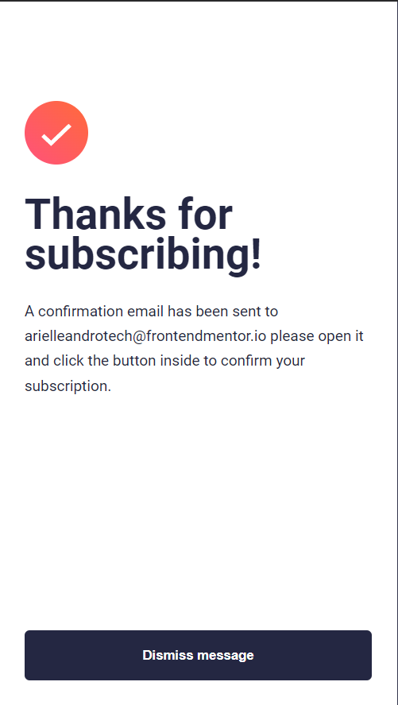

# Frontend Mentor - Newsletter sign-up form with success message solution

This is a solution to the [Newsletter sign-up form with success message challenge on Frontend Mentor](https://www.frontendmentor.io/challenges/newsletter-signup-form-with-success-message-3FC1AZbNrv). Frontend Mentor challenges help you improve your coding skills by building realistic projects. 

## Table of contents

- [Overview](#overview)
  - [The challenge](#the-challenge)
  - [Screenshot](#screenshot)
  - [Links](#links)
- [My process](#my-process)
  - [Built with](#built-with)
  - [What I learned](#what-i-learned)
  - [Useful resources](#useful-resources)
- [Author](#author)


### The challenge

Users should be able to:

- Add their email and submit the form
- See a success message with their email after successfully submitting the form
- See form validation messages if:
  - The field is left empty
  - The email address is not formatted correctly
- View the optimal layout for the interface depending on their device's screen size
- See hover and focus states for all interactive elements on the page

### Screenshot


 


### Links

- Solution URL: [Solution](https://your-solution-url.com)
- Live Site URL: [Live](https://your-live-site-url.com)


### Built with

- Semantic HTML5 markup
- CSS custom properties
- Flexbox
- Mobile-first workflow
- Vanilla JavaScript


### What I learned
I learned about how to validate an email address using JavaScript. 
```js
function validateEmail(email) {
    return String(email)
      .toLowerCase()
      .match(
        /^(([^<>()[\]\\.,;:\s@"]+(\.[^<>()[\]\\.,;:\s@"]+)*)|.(".+"))@((\[[0-9]{1,3}\.[0-9]{1,3}\.[0-9]{1,3}\.[0-9]{1,3}\])|(([a-zA-Z\-0-9]+\.)+[a-zA-Z]{2,}))$/
      );
  }

```


### Useful resources

- [Validating Email Address using JavaScript](https://stackoverflow.com/questions/46155/how-can-i-validate-an-email-address-in-javascript) - You can read more about validating email address using JavaScript. 


## Author

- LinkedIn - [Ariel Leandro Maningas](https://www.linkedin.com/in/ariel-leandro-maningas-999727276/)
- Frontend Mentor - [@arielleandrotech](https://www.frontendmentor.io/profile/arielleandrotech)
- Twitter - [@arielleandro22](https://twitter.com/arielleandro22)


